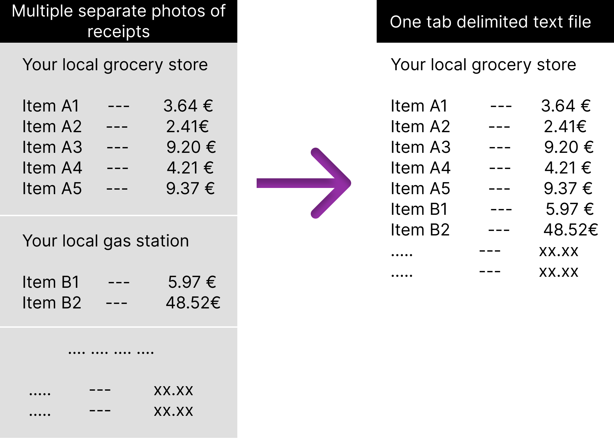

# receipt-reader
A tool for converting images of shopping receipts into tab delimited file(s) for easier use in monitoring monthly expenses.

## 📈 Usage

- Clone the repo
- "pip install -r requirements.txt"
    - Preferably use a virtual env
- Run "python main.py input-folder output-folder"
    - Remember to add "/" in the end of the folder name
    - e.g. "python main.py input/ output/"
